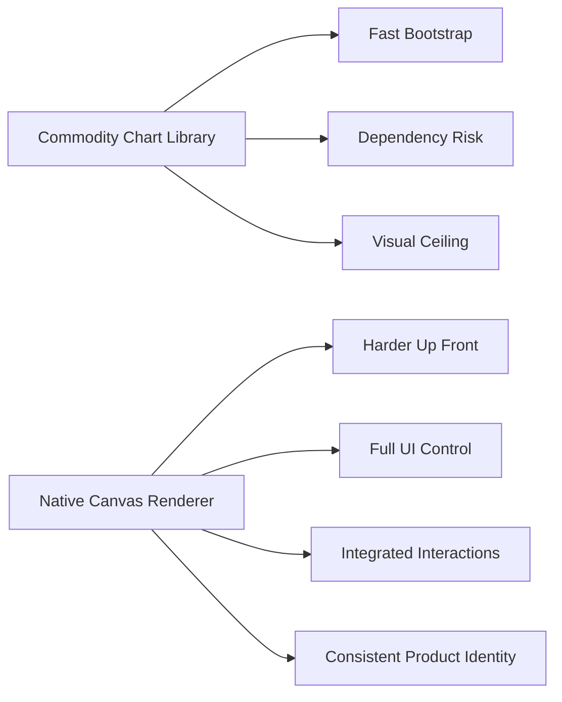
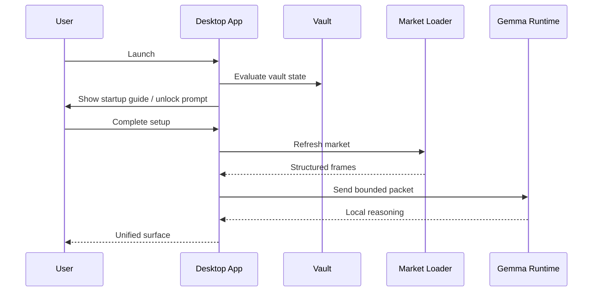
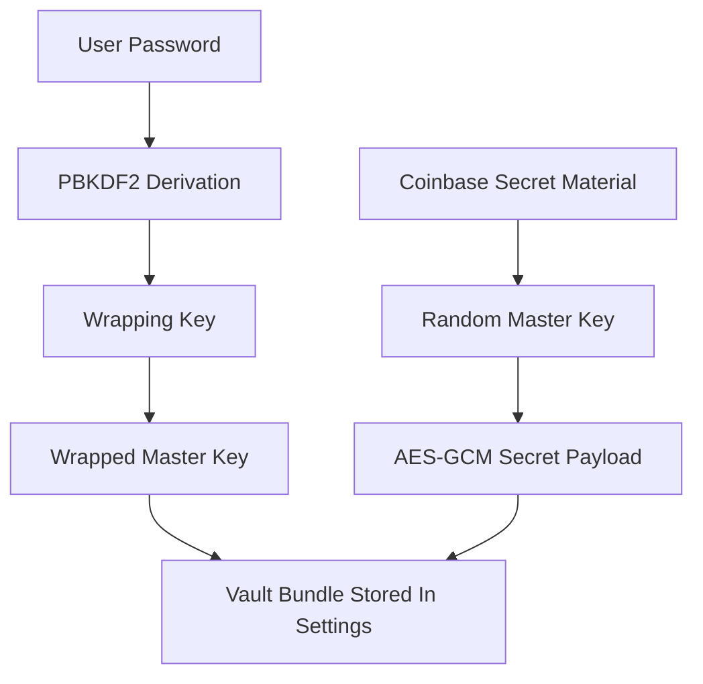
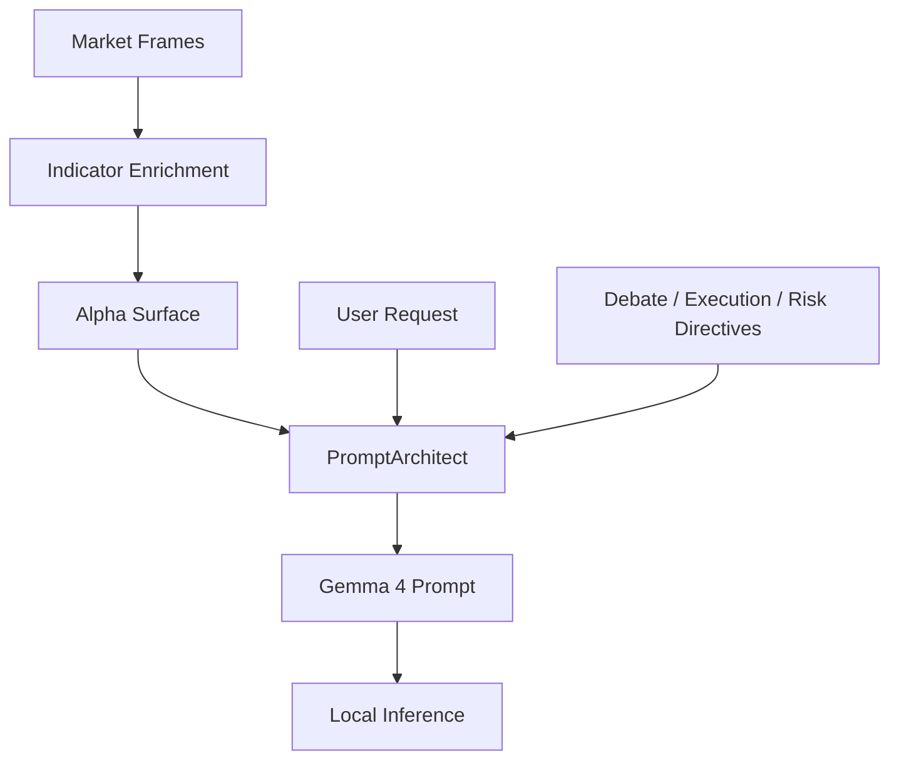
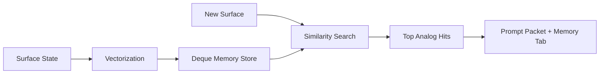
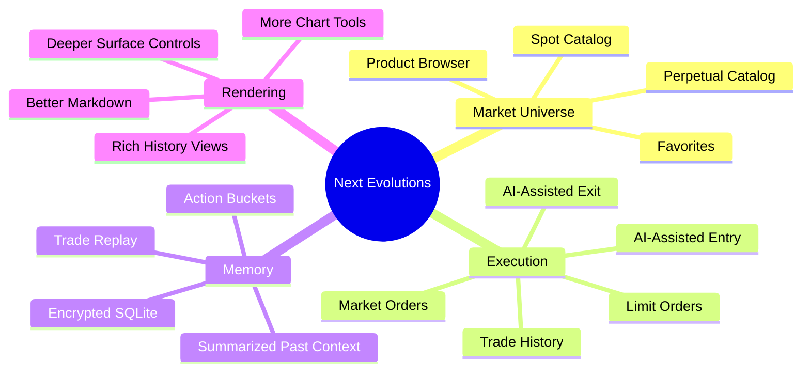

# Building A Local-First Quantum Derivatives Cockpit

## Subtitle

Why a single-file desktop app with a hand-drawn chart engine, a wrapped-key vault, Coinbase rails, and a local Gemma 4 runtime is a more interesting product experiment than yet another browser dashboard.

## The Thesis

There are a lot of AI trading demos.

Most of them are thin.

They paste a few indicators over a charting library, bolt on a chatbot, call an exchange endpoint, and narrate the result as if the product is somehow “intelligent” merely because a model was present in the loop.

This project tries to do something much stranger and much more useful.

It treats the desktop application itself as a cognitive instrument.

Not a chart viewer.
Not just a signal dashboard.
Not just a prompt box.

An instrument.

That means:

- the charting layer matters
- the memory layer matters
- the secret-handling layer matters
- the prompt architecture matters
- the startup flow matters
- the operator ergonomics matter

The result is a product that feels less like a toy and more like a compact trading laboratory.

## The Product Problem

Retail and prosumer crypto workflows are still fragmented in awkward ways:

- charting lives in one window
- exchange account context lives in another
- AI commentary lives in a browser tab
- setup state is half forgotten between sessions
- secrets are either shoved into `.env` files or pasted repeatedly
- visual analysis and structured packet analysis are disconnected

That fragmentation has a cost.

The human loses continuity.
The system loses context.
The model loses structure.

So the app was designed around a single operational thesis:

> compress charting, inference, secrets, execution, and iterative prompting into one local workspace without collapsing into a black-box “AI trader” fantasy.

## Why The Chart Engine Was Rebuilt In-House

Using a plotting library would have been the normal move.

That is exactly why it was the wrong move for this project.

The in-house `tk.Canvas` renderer changes the product in three ways:

1. It eliminates a class of dependency risk and visual mismatch.
2. It makes the chart feel truly native to the application instead of embedded from somewhere else.
3. It turns interaction design into first-class product surface rather than post-processing around someone else’s rendering assumptions.

The chart is now not merely a plot. It is a native surface with:

- candle bodies and wicks
- EMA cloud structure
- basis panel
- flow panel
- quantum overlay panel
- zoom and pan primitives
- hover state and value badges
- summary overlays

That matters because the chart is the emotional center of the app.

If the chart feels generic, the product feels generic.

## The Better Desktop Argument

Browser-based AI trading tools often inherit a hidden weakness:

they are visually rich but operationally thin.

A desktop-native interface lets this project be unusually opinionated:

- the startup flow can behave like a secure workstation boot sequence
- the vault can feel integrated instead of bolted on
- the chart can be drawn to fit the actual application identity
- the model can be local, not just proxied through a cloud API

This is not nostalgia for desktop software.

It is product architecture.

## The Vault Is A UX Feature, Not Just A Security Feature

One of the strongest ideas in the app is that secret handling is not invisible infrastructure. It is a visible operating mode.

That changes the tone of the whole product.

Instead of:

- “paste some keys into a box and hope”

the app now communicates:

- startup guidance
- password creation or unlock intent
- lock state
- rotation possibility
- sealed vs unsealed session semantics

The move from direct passphrase encryption to a wrapped-master-key vault is important technically, but it is just as important narratively.

It tells the user this is a workstation, not a quick script.

The subtle product value is trust.

Not perfect trust.
Not absolute safety.

But enough visible ceremony that the user understands the system respects the seriousness of what it is holding.

## The AI Layer Is Packet-First, Not Persona-First

Many AI trading interfaces are persona-driven.

They want the model to sound smart before they ensure the model is grounded.

This app inverts that.

The model is not first asked to “be genius.”
It is first asked to receive a structured market packet.

That packet includes:

- price state
- basis state
- theory rails
- timeframe summaries
- sensor output
- analog memory hits
- suggested action

Then the user request is layered on top.

That is much closer to what a real analysis system should do.

The important design principle is this:

> the model is downstream of structure, not upstream of it.

That helps prevent the whole app from becoming a hallucination amplifier.

## Why The “Quantum RGB Sensor” Idea Is Interesting

It would be easy to dismiss the sensor layer as gimmickry.

That would miss the point.

The point is not that a small Pennylane routine magically predicts markets.

The point is that the product experiments with bounded auxiliary signals in a disciplined way.

The sensor is intentionally framed as:

- auxiliary context
- a non-authoritative side channel
- one more lens among many

That framing is product maturity.

It acknowledges that unconventional signals can be useful as part of a richer interpretive stack without pretending they are ground truth.

## Memory Is More Powerful When It Is Humble

The in-session entropic memory system is one of the most underrated pieces of the app.

It does not claim to know all prior history.
It does not pretend analog retrieval is proof.

Instead, it asks a more careful question:

> have we seen a surface state that looks enough like this one to be worth surfacing as analogy?

That is a better human-computer interaction pattern than “the AI remembers everything.”

It is more modest.
More inspectable.
And, frankly, more believable.

Memory should help the operator think, not replace thinking.

## Why The UI Works

The visual identity succeeds because it refuses to feel like generic AI software.

It is dark, but not mud-dark.
Bright, but not candy-bright.
Dense, but not cluttered.

The chart dominates.
The right rail supports.
The tabs feel purposeful.
The summary and tile surfaces read like an intelligence panel rather than a form app.

This matters because advanced users judge tools before they consciously admit they are judging them.

If the interface feels cheap, users assume the logic is cheap.

If the interface feels coherent, they grant the system a longer intellectual runway.

## The Most Important Constraint: It Is Still Honest

A good sign in the product is that it repeatedly reminds the user what it is not:

- not guaranteed edge
- not guaranteed profit
- not magical
- not proof just because the model said it

That tone is not marketing weakness.
It is product strength.

The more serious the workflow, the more dangerous false certainty becomes.

This app gets credit for trying to be useful without claiming omniscience.

## Where It Can Go Next

The current architecture has obvious expansion paths:

- richer product discovery across Coinbase spot and derivatives
- broader timeframe menus and presets
- richer markdown rendering in chat
- encrypted historical trade memory
- historical prompt/action bucketing
- AI-assisted but explicitly bounded execution orchestration
- a true order management system instead of a compact execution rail

## Final Take

The most interesting thing about this app is not any single feature.

It is the fact that several normally separate disciplines were forced to coexist:

- charting
- local inference
- secret architecture
- operator workflow
- market refresh resilience
- bounded automation

That produces something rarer than flashy AI software.

It produces software with point of view.

And in a market full of thin wrappers and borrowed interfaces, point of view is one of the few durable advantages left.

## If You Want The Short Version

This project is what happens when someone says:

> what if the AI trading app was not a browser toy, not a cloud dependency bundle, and not a generic chart wrapper, but a serious local instrument with its own visual language and its own operating model?

That question is good.

This repository is a good first answer.
