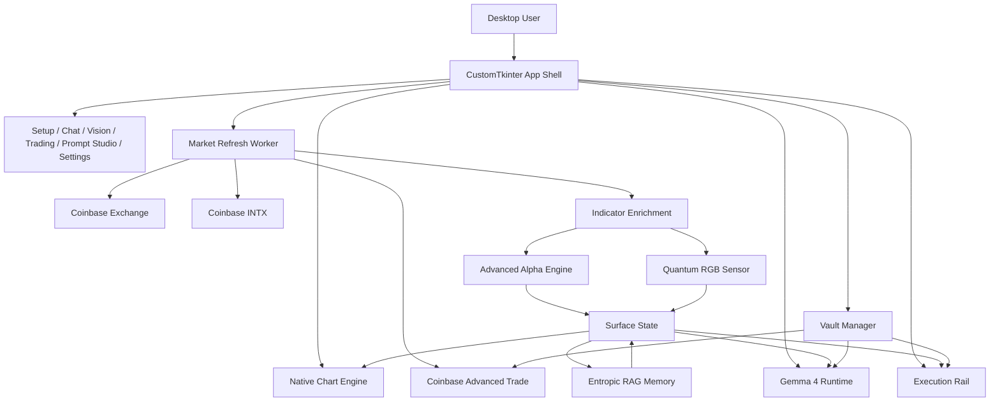
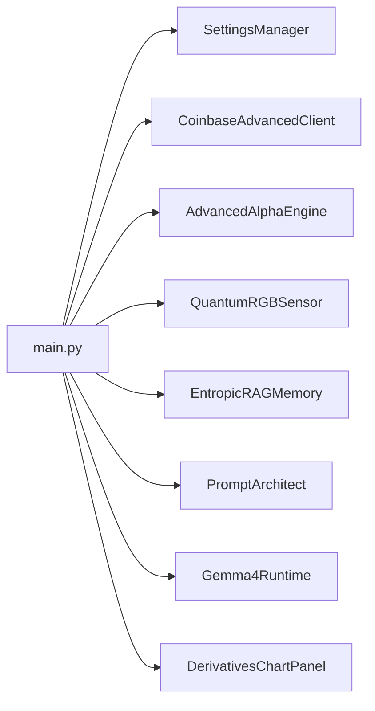
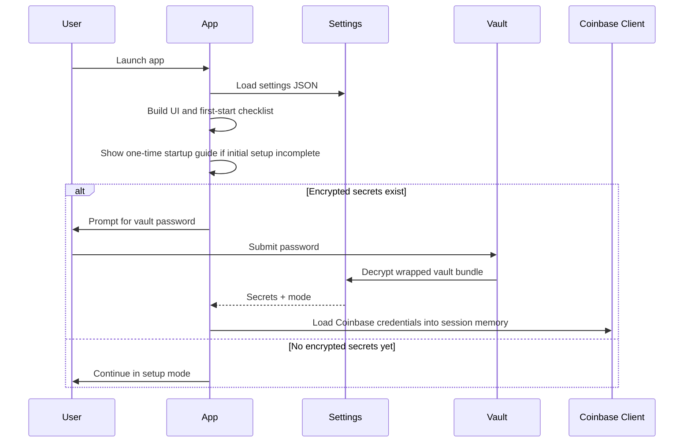
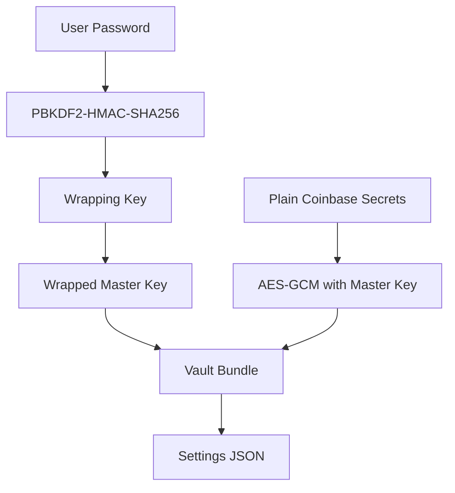
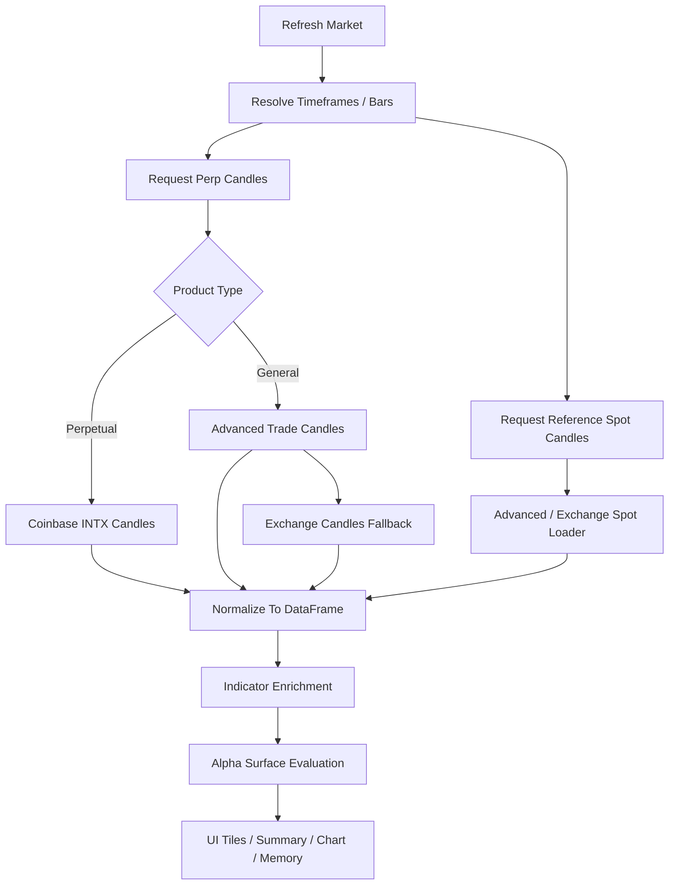
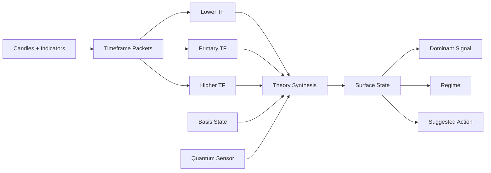
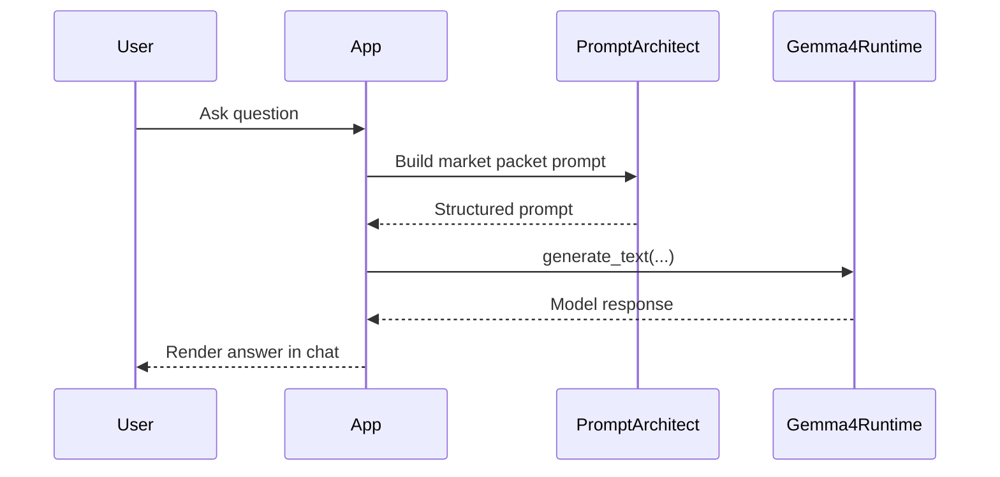
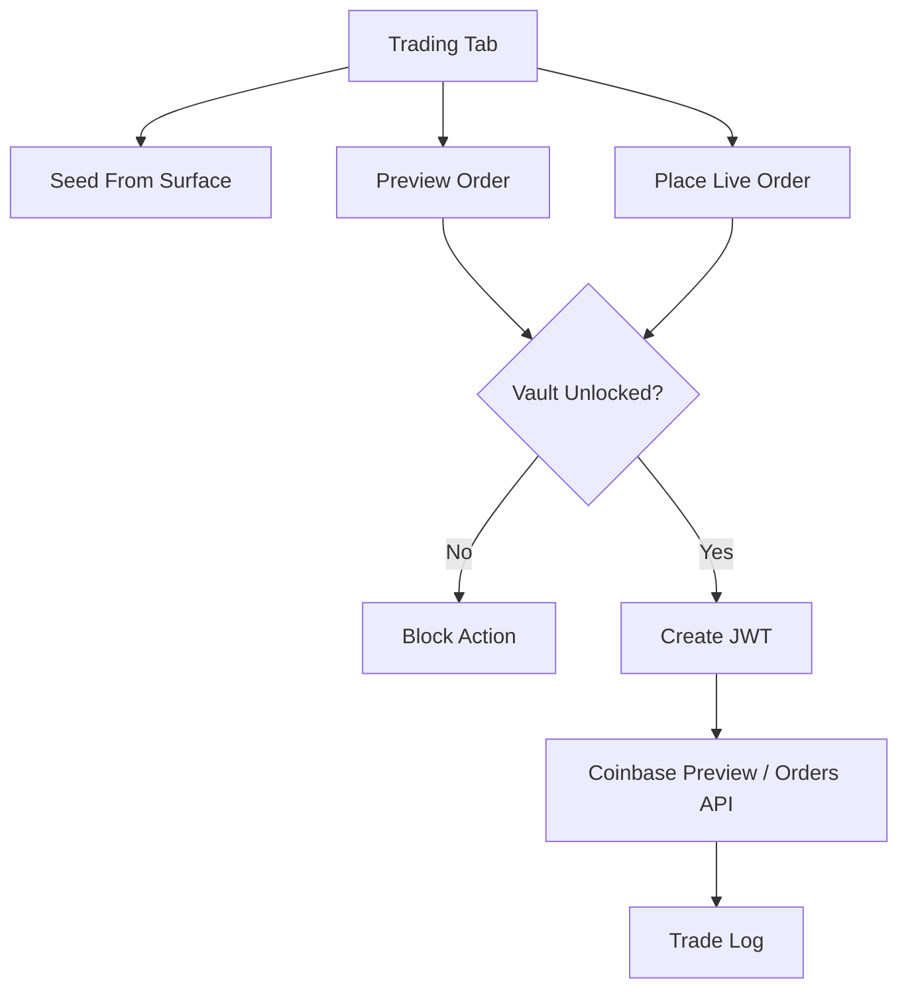
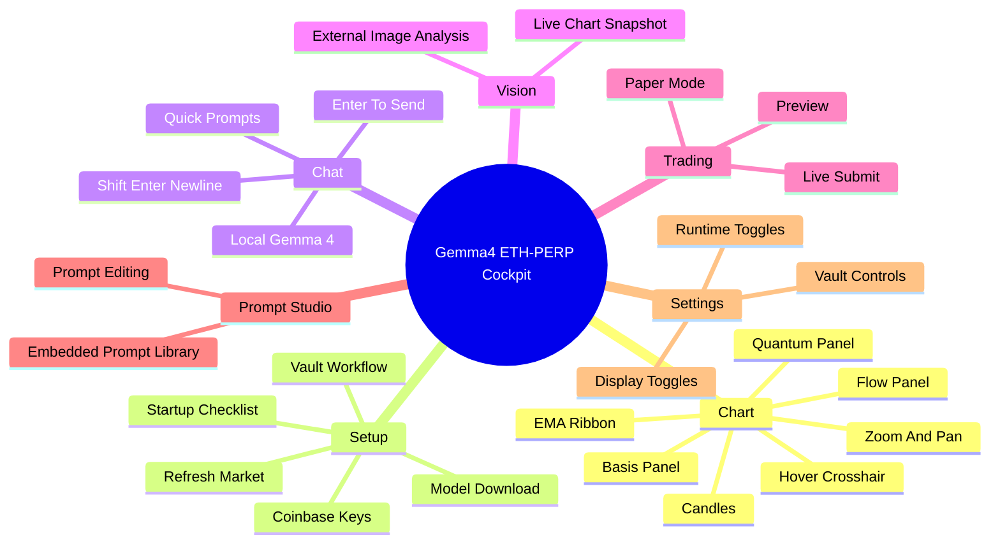

# Gemma4 ETH-PERP Entropic Quantum Intelligence

An in-house, desktop-native, TradingView-inspired ETH-PERP research cockpit built on `customtkinter`, a custom `tk.Canvas` chart engine, Coinbase market/trading rails, an encrypted wrapped-master-key vault, and a local Gemma 4 LiteRT runtime.

This project is opinionated on purpose:

- no `matplotlib`
- no `mplfinance`
- no `Pillow`-driven chart stack
- no browser dependency for the core charting workflow
- no plaintext Coinbase secret display in the UI
- no pretending the model is a trading oracle

It is a local-first derivatives intelligence surface that tries to feel like a hybrid of:

- a serious trading workstation
- a local multimodal LLM operator console
- a vault-aware execution rail
- an experimental market-structure lab


## Table Of Contents

- [What This Is](#what-this-is)
- [Why It Exists](#why-it-exists)
- [Core Capabilities](#core-capabilities)
- [System Tour](#system-tour)
- [Architecture](#architecture)
- [Startup And Vault Lifecycle](#startup-and-vault-lifecycle)
- [Market Data Pipeline](#market-data-pipeline)
- [Signal Engine](#signal-engine)
- [Gemma 4 Integration](#gemma-4-integration)
- [Trading Rail](#trading-rail)
- [UI Surface Map](#ui-surface-map)
- [Repo Layout](#repo-layout)
- [Installation](#installation)
- [Operating Model](#operating-model)
- [Security Notes](#security-notes)
- [Known Constraints](#known-constraints)
- [Roadmap Directions](#roadmap-directions)

## What This Is

The app is a single-file desktop system centered around `main.py`. It combines:

- live or near-live Coinbase market refresh
- an in-house multi-panel candle renderer on `tk.Canvas`
- a multi-timeframe alpha surface derived from EMAs, flow, basis, entropy, structure, and momentum
- a Pennylane-backed RGB / quantum-style auxiliary sensor
- in-session entropic analog memory retrieval
- local Gemma 4 text and multimodal prompting
- a vault-protected Coinbase execution path with preview and live submit rails
- a setup-first onboarding flow for first launch

The current implementation is optimized for `ETH-PERP` plus a spot reference such as `ETH-USD`, but the framework is broad enough to evolve into a richer product browser and trading console.

## Why It Exists

Most retail trading apps fragment the workflow:

- charting in one tool
- exchange execution in another
- AI commentary in a browser tab
- local notes in a text file
- secrets in environment variables or copy-paste chaos

This app collapses those boundaries.

You can launch a local GUI, unlock a vault, refresh market state, inspect a custom chart, interrogate a local model, run visual analysis, and route an execution preview without switching operating context.

## Core Capabilities

### Native Charting

- custom candlestick renderer
- EMA ribbon overlays
- VWMA and basis overlays
- flow and quantum side panels
- mouse-wheel zoom
- drag-to-pan
- hover crosshair
- right-edge value badges
- live summary overlays

### Coinbase Market Access

- Coinbase Advanced Trade public candles
- Coinbase Advanced Trade authenticated candles
- Coinbase Exchange candle fallback
- Coinbase International Exchange candle support for perpetual instruments
- candidate symbol normalization for `ETH-PERP` / `ETH-PERP-INTX`

### Local AI Stack

- Gemma 4 LiteRT text generation
- multimodal chart/image prompting when supported by the installed runtime
- packetized market-state prompting
- debate, execution, and risk directives
- reusable embedded prompt library

### Memory And Surface Reasoning

- in-session analog retrieval via vector similarity
- surface state recall
- theory matrix display
- sensor output display
- summary rail for regime and action synthesis

### Vault And Secret Handling

- wrapped-master-key AES-GCM secret storage
- one-time startup guide popup
- popup-based unlock/create/rotate flows
- masked Coinbase private-key presentation
- lock / unlock / rotate vault controls

### Trading Rail

- preview order through Coinbase
- live market order path with explicit confirmation
- paper/live mode toggles
- leverage and margin controls
- signal-seeding into execution controls

## System Tour

### 1. Setup

The `Setup` tab is the first-start operating surface:

- model path
- Coinbase API key
- Coinbase private key via masked load actions
- vault password entry or popup creation flow
- product selection
- model download action
- market refresh action
- checklist and rolling status log

### 2. Chat

The `Chat` tab is where packetized market analysis meets local inference:

- quick prompts
- freeform question area
- `Enter` to send
- `Shift+Enter` to add a newline
- debate, execution-map, and risk-officer shortcuts

### 3. Vision

The `Vision` tab lets the model compare text packet context against:

- the live chart snapshot exported from the in-house canvas
- a user-selected image

### 4. Trading

The `Trading` tab is the bounded execution rail:

- choose side
- define quote size
- choose leverage
- select margin type
- preview
- place live order if explicitly enabled

### 5. Prompt Studio

The `Prompt Studio` tab exposes the embedded LLM prompt system:

- systems
- debate chains
- execution directives
- visual prompts
- reusable library previews

### 6. Settings

The `Settings` tab is where operational controls live:

- vault controls
- model controls
- market refresh parameters
- display toggles
- autonomy toggles
- memory toggles

## Architecture



### Runtime Layering



## Startup And Vault Lifecycle

The app is built around a setup-first and vault-aware launch model.



### Vault Model



The vault strategy is intentionally stronger than simple direct password encryption:

- a password-derived key wraps a random master key
- the master key encrypts the actual Coinbase secret payload
- rotation can create a fresh seal without exposing secrets in UI plaintext
- private key text is now masked in the visible widgets

## Market Data Pipeline

Market loading is resilient rather than single-endpoint fragile.



### Timeframe Handling

Today the core refresh loop works from:

- primary timeframe
- secondary timeframe
- tertiary timeframe

The renderer, indicator pipeline, and evaluation model are already structured around timeframe dictionaries, which makes future expansion to a broader timeframe lattice straightforward.

## Signal Engine

The alpha layer is not a single score. It is a composite of structural fields.

### Core Components

- trend
- structure
- momentum
- volatility
- volume pressure
- entropy
- sweep score
- ribbon pressure
- basis percent
- basis z-score
- sensor alignment
- sensor gain

### Derived Theory Rails

The surface computes multiple named rails including:

- `COHERENCE_FIELD`
- `LIQUIDITY_SWEEP`
- `COMPRESSION_BREAKOUT`
- `REFLEXIVE_ACCELERATION`
- `ENTROPIC_DRIFT`
- `FUNDING_PRESSURE_TENSOR`
- `BASIS_DISLOCATION_PULSE`
- `LIQUIDATION_LADDER_MAGNETISM`
- `INVENTORY_IMBALANCE_RESONANCE`
- `CONVEXITY_TRAP_GRADIENT`
- plus additional concept rails such as maker absorption, regime handoff, term-structure shear, and entropic carry harvesting



## Gemma 4 Integration

Gemma 4 is not used as a raw chat toy. It is fed a structured market packet first.

### Prompt Strategy

The app builds a bounded prompt envelope containing:

- system constraints
- structured market packet JSON
- explicit user request
- internal debate lens
- execution directive
- risk audit directive

### Multimodal Strategy

When the installed LiteRT engine supports vision:

- system text is sent as a conversation preamble
- user text is sent as a structured packet-plus-task message
- image input is attached as a native message asset



## Trading Rail

The execution side is deliberately constrained.



### Current Trading Characteristics

- preview-first workflow
- explicit live trading toggle
- explicit confirmation before live submit
- signal seeding from current surface
- market-order execution path through Coinbase Advanced Trade

This keeps the app usable as a research cockpit even for users who never enable live execution.

## UI Surface Map



## Repo Layout

```text
.
├── main.py
├── demo1.png
├── requirements.txt
├── .gitignore
├── README.md
└── BLOG.md
```

### Important Files

- `main.py`: the entire application runtime
- `demo1.png`: screenshot used in documentation
- `requirements.txt`: pinned runtime dependencies
- `main_eth_perp_quantum_settings.json`: local runtime settings and encrypted vault bundle, intentionally ignored by git

## Installation

### 1. Create An Environment

```bash
python3 -m venv .venv
source .venv/bin/activate
pip install -r requirements.txt
```

### 2. Launch

```bash
python3 main.py
```

### 3. First Run

Use the startup workflow to:

1. choose or download a Gemma model
2. add Coinbase API credentials
3. create a vault password when prompted
4. save and unlock the vault
5. refresh market data

## Operating Model

### Research Mode

If you only want analysis:

- leave live trading disabled
- load market data
- use Chat and Vision for synthesis
- use Prompt Studio to tune behavior

### Execution Mode

If you want bounded execution access:

- save Coinbase credentials into the vault
- unlock the vault for the current session
- preview first
- only enable live trading if you accept the operational risk

## Security Notes

### Secrets

- Coinbase private key is not shown back in plaintext in the UI
- secret storage uses wrapped-master-key AES-GCM
- vault password is not persisted in the settings JSON
- lock / unlock / rotate lifecycle is built into the GUI

### Model Runtime

- model download verifies SHA256
- the runtime is local-first
- if the model is missing, the app falls back to local signal-lab behavior instead of silently pretending inference worked

### Scope

This is research software, not a safety-certified trading appliance. You should treat it as:

- a local workstation
- an experimental operator console
- a bounded automation shell

You should not treat it as:

- guaranteed-execution software
- guaranteed-profit software
- a substitute for risk management

## Known Constraints

- the app is still organized as a monolithic `main.py`
- market catalog breadth is still narrower than a full exchange terminal
- the live order rail is intentionally simpler than a full OMS
- in-session memory is not yet a full historical encrypted SQLite knowledge graph
- chat rendering is currently textbox-based rather than a complete rich markdown document engine

## Roadmap Directions

Natural next steps from the current architecture include:

- broader timeframe catalogs
- richer product browsing and filtering
- historical encrypted trade memory
- richer markdown rendering
- advanced order types
- AI-assisted entry / exit orchestration under explicit user controls
- deeper portfolio and history primitives

## Documentation Companion

For the long-form product and engineering essay, see [BLOG.md](BLOG.md).
