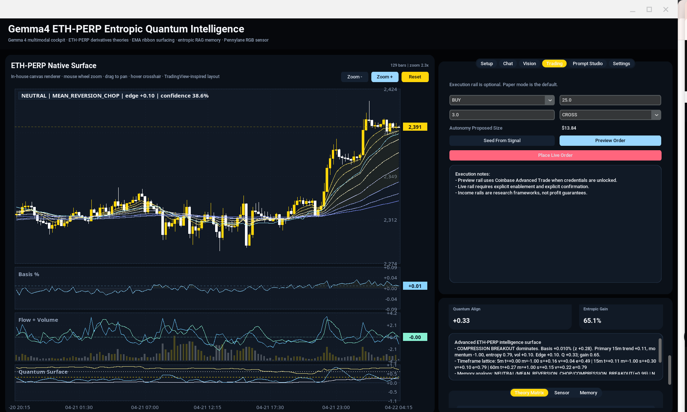

# Trade Humoid

A local-first Coinbase derivatives research cockpit built as a single Python desktop app.

Trade Humoid combines a `customtkinter` shell, a native `tk.Canvas` market chart, Coinbase market and execution rails, an encrypted wrapped-master-key vault, an embedded prompt studio, an optional local Gemma 4 LiteRT runtime, and an experimental multi-timeframe signal surface.

The app is designed for discretionary research and guarded execution workflows. It is not a trading oracle, an exchange terminal replacement, or a promise of edge.



## What Changed Recently

Recent commits heavily expanded `main.py` from a chart-and-chat prototype into a fuller workstation:

- setup-first launch flow with checklist, model download, market refresh, and vault actions
- wrapped-master AES-GCM Coinbase vault with unlock, lock, rotate, audit metadata, and legacy direct-vault migration
- masked private-key handling through paste/file-load actions instead of plaintext display
- encrypted SQLite product cache keyed from the unlocked vault master key
- centralized market picker used by chart, setup, settings, and trading controls
- Coinbase Advanced Trade, Exchange, and International Exchange candle paths with product-id fallbacks
- local resampling for sparse timeframes such as 30m, 2h, 4h, 12h, 1W, and 1M
- richer alpha surface with 15 theory rails, including term-structure shear, maker absorption, funding reflex inversion, entropic carry, and regime handoff
- Pennylane/RGB auxiliary sensor and in-session analog memory retrieval
- Prompt Studio with editable prompt-pack JSON and a large embedded research/execution/risk prompt library
- AI market read, risk audit, and execution-plan buttons inside the Trading tab
- chart fullscreen mode, hideable side tray, timeframe buttons, hover/crosshair behavior, and right-edge market overlays

## Status

This repo is currently a compact desktop research app:

- main app: [`main.py`](main.py)
- dependency pins: [`requirements.txt`](requirements.txt)
- long-form product notes: [`BLOG.md`](BLOG.md)
- local runtime/settings/cache files are intentionally ignored by git

The app defaults to `ETH-PERP` with `ETH-USD` as the reference market, but the product picker and Coinbase product cache are built to support broader Coinbase symbols, including Advanced Trade futures-style products when Coinbase exposes usable candles.

## Core Features

### Native Market Workstation

- custom candle renderer on `tk.Canvas`
- EMA ribbon with 8/13/21/34/55/89/144/233 spans
- VWMA, basis, flow, entropy, and quantum/sensor panels
- hover crosshair and live value badges
- scroll zoom, drag pan, timeframe buttons, fullscreen chart mode, and side-tray collapse
- no `matplotlib`, no browser chart dependency

### Coinbase Data Layer

- public Coinbase Advanced Trade candles
- authenticated Advanced Trade candles when the vault is unlocked
- Coinbase Exchange candle fallback for compatible spot products
- Coinbase International Exchange candle support for perpetual instruments
- product-id normalization for symbols such as `ETH-PERP`, `ETH-PERP-INTX`, `ETH-USD`, and `ETH-USDC`
- local resampling where Coinbase does not expose a stable native granularity
- market refresh runs in a background thread and reports failures in Setup/Settings

### Signal Surface

The `AdvancedAlphaEngine` converts enriched candles into a `SurfaceState` with:

- multi-timeframe trend, momentum, structure, volatility, volume pressure, entropy, sweep, and ribbon pressure
- perp-vs-reference basis percent and basis z-state
- dominant signal: `LONG_BIAS`, `SHORT_BIAS`, or `NEUTRAL`
- regime labels such as `DIRECTIONAL_DISCOVERY`, `BASIS_STRETCH`, `REGIME_HANDOFF`, `MEAN_REVERSION_CHOP`, and `TURBULENT_EXPANSION`
- anomaly labels such as `BASIS_DISLOCATION`, `LIQUIDATION_SWEEP`, and `FRAGILE_REGIME`
- suggested research action and bounded paper notional

The theory matrix currently scores:

- `COHERENCE_FIELD`
- `LIQUIDITY_SWEEP`
- `COMPRESSION_BREAKOUT`
- `REFLEXIVE_ACCELERATION`
- `ENTROPIC_DRIFT`
- `FUNDING_PRESSURE_TENSOR`
- `BASIS_DISLOCATION_PULSE`
- `LIQUIDATION_LADDER_MAGNETISM`
- `INVENTORY_IMBALANCE_RESONANCE`
- `CONVEXITY_TRAP_GRADIENT`
- `TERM_STRUCTURE_SHEAR`
- `MAKER_ABSORPTION_EDGE`
- `FUNDING_REFLEX_INVERSION`
- `ENTROPIC_CARRY_HARVEST`
- `REGIME_HANDOFF_ARBITRAGE`

### Local AI Stack

- optional Gemma 4 LiteRT text generation through `litert-lm`
- optional multimodal/image path when the installed LiteRT binding supports it
- text-only fallback commentary when the model file or runtime is unavailable
- packetized prompt builder that includes market state, reference-market state, top theories, memory hits, and risk context
- quick prompts for research memos, basis maps, ladder sweeps, income rails, risk audits, contrarian views, data-quality checks, and flat/no-trade discipline

### Prompt Studio

Prompt Studio exposes the embedded prompt pack directly in the UI:

- reload/save prompt-pack JSON
- browse a flattened library of system prompts, research chains, income rails, execution prompts, visual prompts, decision engines, and risk/governance prompts
- insert selected prompts into Chat
- build the exact current market prompt for inspection

### Vault And Security

Coinbase credentials are stored in `main_eth_perp_quantum_settings.json` as an encrypted bundle.

Current vault behavior:

- AES-GCM secret payload
- wrapped-master-key vault format: `wrapped_master_v2`
- PBKDF2-HMAC-SHA256 passphrase wrapping with 350,000 iterations
- vault password is not persisted
- Coinbase private key is masked in the UI
- unlock loads credentials only into the current session
- lock clears decrypted credential fields
- rotate reseals the bundle with a fresh wrapped master key
- legacy direct-passphrase vaults are upgraded after successful unlock
- vault security metadata tracks mode, last unlock, last rotation, unlock count, and a short audit log

The product cache is stored in `coinbase_product_cache.sqlite3`; product payloads are encrypted per row with a key derived from the unlocked vault master key.

### Trading Rail

The Trading tab is deliberately conservative:

- paper mode is enabled by default
- live trading is disabled by default
- market selection is centralized through the chart-side Market button
- preview order uses Coinbase Advanced Trade preview API
- live order requires live trading to be enabled, a vault unlock, and an explicit confirmation dialog
- seed-from-signal fills side/size from the current surface, but does not submit
- AI trading replies can produce a market read, risk audit, or conditional execution plan

## Installation

Use Python 3.11+ with Tk available on your system.

```bash
python -m venv .venv
source .venv/bin/activate
pip install -r requirements.txt
```

On Linux, Tk may need to be installed through the OS package manager before `customtkinter` can open a window.

## Running

```bash
python main.py
```

The app creates local runtime directories/files as needed:

- `models/`
- `.litert_lm_cache/`
- `main_eth_perp_quantum_settings.json`
- `coinbase_product_cache.sqlite3`

These are ignored by git because they may contain local settings, credentials, caches, or large model files.

## First-Run Workflow

1. Start the app with `python main.py`.
2. Open the Setup tab if it is not selected automatically.
3. Choose or download the Gemma model.
4. Add Coinbase API credentials only if you want authenticated candles, product caching, preview, or live order rails.
5. Save and unlock the encrypted vault.
6. Refresh products if you want a broader product picker.
7. Select the active market from the Market button beside the chart controls.
8. Refresh market data and inspect the surface before using Chat, Vision, or Trading.

The model download action fetches:

```text
https://huggingface.co/litert-community/gemma-4-E2B-it-litert-lm/resolve/main/gemma-4-E2B-it.litertlm
```

and verifies the expected SHA256 hard-coded in `main.py`.

## UI Map

- `Setup`: first-start checklist, vault save/unlock, model download, product refresh, market refresh
- `Chat`: quick prompt buttons, packetized Gemma requests, local fallback commentary
- `Vision`: live chart snapshot or chosen image analysis, with packet-only fallback
- `Trading`: signal seeding, preview, guarded live order, AI market/risk/execution replies
- `Prompt Studio`: prompt library browser and prompt-pack JSON editor
- `Settings`: model, refresh cadence, timeframes, bars, order defaults, autonomy thresholds, vault tools, display toggles
- bottom-right surface panel: price, signal, regime, confidence, phase, color encoding, dominant theory, suggested action, anomaly, edge, sensor, memory

Useful keys:

- `F11`: toggle chart fullscreen
- `Escape`: leave chart fullscreen
- `F10`: hide/show the side tray
- `Enter` in Chat: send
- `Shift+Enter` in Chat: newline

## Configuration

Defaults live in `DEFAULT_SETTINGS` inside `main.py`.

Important settings include:

- `product_id`: default `ETH-PERP`
- `reference_product_id`: default `ETH-USD`
- `refresh_seconds`: default `25`
- `timeframe_minutes`: default `15`
- `secondary_minutes`: default `5`
- `tertiary_minutes`: default `60`
- `bars`: default `320`
- `paper_trading_enabled`: default `true`
- `live_trading_enabled`: default `false`
- `autonomy_enabled`: default `true`
- `autonomy_min_confidence`: default `0.70`
- `autonomy_cooldown_seconds`: default `420`
- `rag_memory_enabled`: default `true`
- `pennylane_sensor_enabled`: default `true`

## Operating Modes

### Research Only

- do not add Coinbase credentials
- use public candles where available
- keep live trading disabled
- use Chat, Vision, Prompt Studio, and the signal surface for analysis

### Authenticated Research

- save Coinbase credentials into the vault
- unlock the vault when needed
- refresh products and authenticated candles
- use preview order responses for research without enabling live trading

### Guarded Execution

- unlock the vault
- keep paper mode on while testing
- preview every order first
- enable live trading only when you intentionally accept the risk
- use the explicit confirmation dialog before any live market order

## Data Quality Notes

Coinbase products do not all expose the same candle paths. The app tries, in order, the relevant Coinbase routes and records failures in the UI.

Some products may return:

- unavailable granularities
- sparse futures candles
- mismatched public/auth candle support
- unsupported Exchange fallback symbols
- stale data near expiry or on thin products

When this happens, the app either resamples from a smaller reliable timeframe, falls back to a reference frame, or marks the market packet as unusable. Directional analysis should be downgraded whenever candle freshness, reference-market quality, or product identity is uncertain.

## Development Notes

This project is intentionally monolithic right now. The key internal pieces are:

- `SettingsManager`: settings, vault metadata, vault migration, secret save/unlock/rotate
- `EncryptedProductStore`: encrypted SQLite product catalog cache
- `CoinbaseAdvancedClient`: Coinbase JWT signing, candles, products, order preview, live order placement
- `enrich_indicators`: EMA, VWMA, MACD, RSI, ATR, volume, candle-shape, and flow features
- `QuantumRGBSensor`: optional Pennylane/RGB auxiliary state
- `AdvancedAlphaEngine`: multi-timeframe theory and regime engine
- `EntropicRAGMemory`: in-session analog retrieval
- `Gemma4Runtime`: LiteRT text and multimodal wrapper
- `PromptArchitect`: packet-to-prompt builder
- `DerivativesChartPanel`: native chart renderer
- `App`: full desktop UI and workflow orchestration

Good next refactors would be to split `main.py` into modules around those boundaries, add focused tests for vault migration/product-id normalization/resampling, and introduce a small typed config layer.

## Safety

This is research software. It can help organize market evidence, but it can also be wrong, stale, overfit, or mechanically blocked by exchange behavior.

Do not treat:

- model output as financial advice
- suggested actions as orders
- confidence as certainty
- preview success as live-fill certainty
- local indicators as ground truth

Live trading is present because the app is an operator console, not because automation is inherently safe. Keep live mode disabled unless you explicitly mean to use it.

## Scientific Reading

This section folds in the analysis from `readme_unbind.md`: a more formal reading of the code as an experimental derivatives-intelligence system, plus the rawblog-style mathematical frame behind the cockpit.

### Abstract

Trade Humoid can be read as an entropic, multi-layer decision-support instrument for crypto derivatives. It combines live Coinbase market-data acquisition, multi-timeframe candle processing, EMA ribbon analysis, entropy-inspired diagnostics, encrypted credential management, local model prompting, and a desktop cockpit interface. Its central purpose is not merely to display price. It transforms fragmented market evidence into a structured packet: trend, basis, liquidity, volatility, sensor output, analog memory, and risk constraints are gathered into one surface state before any LLM or execution workflow is allowed to narrate the market.

From a scientific software perspective, the interesting feature is the fusion of domains usually kept separate: financial data engineering, GUI ergonomics, cryptographic secret storage, local model inference, symbolic market ontology, and quantitative feature extraction. The result is best understood as a risk-aware research cockpit rather than an autonomous trading bot. The language of "quantum", "entropy", "coherence", and "sensor surfaces" is partly metaphorical and experimental; it should not be mistaken for validated quantum advantage or guaranteed forecasting power.

The strongest parts of the system are concrete: Coinbase endpoint handling, candle normalization, AES-GCM vault encryption, product-ID sanitation, prompt-level risk constraints, and explicit "stay flat" logic. The main scientific caution is that poetic theory names can sound more precise than their empirical foundation. Every symbolic label should be tied back to deterministic features, logged evidence, and hard risk gates.

Keywords: derivatives intelligence, crypto perpetual futures, Coinbase API, entropy, EMA ribbons, market structure, AES-GCM, local language models, prompt engineering, risk governance, CustomTkinter, financial decision support.

### System As A Tuple

The whole application can be compressed into:

```text
S = (D, F, E, V, P, M, R, G)
```

Where:

- `D`: market data acquisition
- `F`: feature extraction
- `E`: entropy, edge, basis, and regime computation
- `V`: vault and encrypted credential state
- `P`: prompt architecture
- `M`: local model runtime
- `R`: risk governance
- `G`: graphical cockpit

The runtime loop is:

```text
observe -> normalize -> extract -> classify -> prompt -> audit -> display -> wait -> repeat
```

This makes the project a closed-loop interpretive machine. It is not just a chart, not just a Coinbase client, and not just an LLM wrapper.

### Data Is A Hostile Input

The data layer treats Coinbase market data as something to negotiate with, not something to trust blindly. In simplified form, candle selection is closer to:

```text
C_t = argmax_e Q(fetch(e, product, timeframe, bars))

e in {
  Coinbase Exchange,
  Advanced Trade Public,
  Advanced Trade Authenticated,
  Coinbase International
}
```

Where quality is a product of basic checks:

```text
Q(C) = nonempty(C)
     * valid_schema(C)
     * valid_timestamps(C)
     * valid_ohlcv(C)
```

A weak or missing candle response should not become a market opinion. The correct no-view gate is:

```text
NoView = not (Fresh and Liquid and SchemaValid and ReferenceAligned)
```

This matters because bad market data can create fake beliefs:

- a blank candle response can look like no volatility
- a stale candle can look like compression
- a wrong product can look like basis dislocation
- a mismatched reference market can look like crowding

The prompt library already includes symbol audits, candle integrity audits, reference-market checks, and stale-data kill switches. A future hardening step is to implement those as deterministic pre-model checks.

### Candle Frame

Every exchange response is normalized into the internal candle object:

```text
X_t = [Open_t, High_t, Low_t, Close_t, Volume_t]
```

Local resampling follows the standard OHLCV aggregation:

```text
Open'_k   = first(Open_t in W_k)
High'_k   = max(High_t in W_k)
Low'_k    = min(Low_t in W_k)
Close'_k  = last(Close_t in W_k)
Volume'_k = sum(Volume_t in W_k)
```

The important caveat is provenance:

```text
source(C') = local_resample(source(C))
```

Resampled candles are useful and often necessary, but the model should know whether it is interpreting direct exchange observations or locally constructed intervals.

### EMA Ribbon Geometry

The app uses the EMA spans:

```text
K = {8, 13, 21, 34, 55, 89, 144, 233}
```

The base equation is:

```text
EMA_k(t) = alpha_k * P_t + (1 - alpha_k) * EMA_k(t - 1)
alpha_k  = 2 / (k + 1)
```

The ribbon can be treated as a vector:

```text
R_t = [
  EMA_8(t), EMA_13(t), EMA_21(t), EMA_34(t),
  EMA_55(t), EMA_89(t), EMA_144(t), EMA_233(t)
]
```

Bullish ordering:

```text
EMA_8 > EMA_13 > EMA_21 > EMA_34 > EMA_55 > EMA_89
```

Bearish ordering:

```text
EMA_8 < EMA_13 < EMA_21 < EMA_34 < EMA_55 < EMA_89
```

Ribbon spread:

```text
S_EMA(t) = (max_k EMA_k(t) - min_k EMA_k(t)) / P_t
```

Ribbon slope:

```text
grad_EMA_k(t) = EMA_k(t) - EMA_k(t - 1)
```

A clean trend looks like ordered EMAs, slope agreement, and controlled spread expansion. A trap transition often looks like compression plus sudden price movement plus contradiction from basis, wick behavior, or reference-market state.

### Entropy Discipline

The code uses normalized histogram entropy:

```text
H(X)   = -sum_i p_i * log(p_i)
H_N(X) = H(X) / log(b)
```

With:

```text
0 <= H_N(X) <= 1
```

The raw warning from `readme_unbind.md` is important: entropy is not magic. A high entropy value does not automatically mean "bad market" or "untradeable market." It means the selected variable is more evenly distributed across bins over a selected window.

The precise form should be:

```text
H_N(X; W, b)
```

Where:

- `X`: selected variable
- `W`: lookback window
- `b`: histogram bin count

Useful entropy claims should preserve variable identity:

```text
H_N(returns) != H_N(ribbon_spread) != H_N(basis) != H_N(volume)
```

A mature version of the cockpit would track an entropy vector:

```text
H_t = [
  H_N(returns_t),
  H_N(delta_price_t),
  H_N(ribbon_spread_t),
  H_N(basis_t),
  H_N(volume_t),
  H_N(delta_ema_t)
]
```

Then regimes can be described more carefully:

```text
OrderlyTrend      = H_N(returns) down and ribbon_spread up and slope_agreement up
Chop              = H_N(returns) up and ribbon_spread down and slope_agreement down
VolatilityRelease = H_N(returns) up and ribbon_spread up and abs(delta_price) up
```

### Basis As A Proxy

The default relationship is `ETH-PERP` against `ETH-USD`, but the same logic applies to any derivative/reference pair with valid data.

Basis can be represented as:

```text
B_t = (P_derivative_t - P_reference_t) / P_reference_t
```

Basis z-score:

```text
Z_B(t) = (B_t - mean(B, W)) / (std(B, W) + epsilon)
```

Basis is useful because perpetual markets do not live alone. Their relationship to spot or reference markets can suggest whether derivative traders are paying up, leaning short, crowding long, or creating mean-reversion pressure.

But basis is not funding, not open interest, and not liquidation data. The correct inference chain is:

```text
B_t -> possible crowding
```

Not:

```text
B_t -> known crowding
```

This is why the prompt pack's rule "never confuse a proxy with ground truth" matters.

### Surface State

The `SurfaceState` is the soul of the app. It compresses market reality into:

```text
S_t = [
  P_t,
  P_reference_t,
  B_t,
  Z_B(t),
  T_t,
  H_t,
  R_t,
  Q_t,
  G_t,
  A_t,
  C_t
]
```

Where:

- `P_t`: selected product price
- `P_reference_t`: reference price
- `B_t`: basis
- `Z_B(t)`: basis z-score
- `T_t`: timeframe feature vector
- `H_t`: entropy state
- `R_t`: EMA ribbon state
- `Q_t`: auxiliary sensor alignment
- `G_t`: entropic gain
- `A_t`: anomaly status
- `C_t`: confidence

The app maps edge into a phase wheel:

```text
Theta_t = floor(((E_t + 1) / 2) * 299) mod 300
```

And maps sensor information into a color encoding:

```text
S_t -> (Theta_t, RGB_t, regime_t, signal_t, confidence_t)
```

This does not prove anything about the market. It gives the UI a compact way to show state drift.

### Color Encoding

The color surface is best interpreted as cognitive compression:

```text
RGB_t = Phi(Q_t, G_t, H_t, E_t, A_t)
```

If PennyLane is enabled, the mature interpretation is:

```text
Q_t = bounded auxiliary transform of features
```

Not:

```text
Q_t = causal market oracle
```

The prompt pack correctly treats the Pennylane/RGB layer as auxiliary context that must not overpower direct market structure.

### Theory Packet

The theory labels form a trader's ontology. A scientific formalization treats each named concept as a scalar:

```text
tau_i(t) in [-1, 1]
tau_t = [tau_1(t), tau_2(t), ..., tau_n(t)]
```

Composite edge can then be represented as:

```text
E_t = sum_i w_i * tau_i(t)
    - lambda_F * F_t
    - lambda_U * U_t
    - lambda_D * D_t
```

Where:

- `F_t`: risk fragility
- `U_t`: uncertainty or data weakness
- `D_t`: contradiction density

The dangerous version says:

```text
ConvexityTrapGradient is high, therefore trade.
```

The mature version says:

```text
ConvexityTrapGradient > threshold -> increase trap-risk penalty.
```

The app already moves in that direction by surfacing `PASS`, `WATCH`, `REJECT`, flat cases, invalidations, and risk boxes through the prompt library.

### Confidence Is Not Edge

Signal score and confidence must remain separate:

```text
E_t = directional or regime-weighted edge
C_t = quality-adjusted belief in the packet
```

A large signal from weak data should have low confidence. A mild signal from excellent data can have moderate confidence.

A useful confidence skeleton is:

```text
C_t = sigmoid(
  a0
  + a1 * Q_data
  + a2 * Q_reference
  + a3 * Q_timeframe
  - a4 * H_t
  - a5 * D_t
  - a6 * L_t
)
```

Where:

- `Q_data`: data quality
- `Q_reference`: reference alignment quality
- `Q_timeframe`: multi-timeframe agreement
- `H_t`: entropy penalty
- `D_t`: contradiction penalty
- `L_t`: liquidity or staleness penalty

Suggested notional should shrink with fragility and crowding:

```text
N_t = N_max * C_t * (1 - F_t) * (1 - K_t)
```

The current code follows this spirit by bounding suggested notional through confidence, risk fragility, and crowding.

### Vault Model

The vault treats secrets as hazardous material:

```text
K_m = random_256_bit_master_key
K_w = PBKDF2(passphrase, salt, 350000)
C_m = AESGCM(K_w, K_m, AAD_master)
C_s = AESGCM(K_m, secrets, AAD_secret)
```

Where:

- `K_m`: master key
- `K_w`: password-derived wrapping key
- `C_m`: wrapped master key
- `C_s`: encrypted Coinbase secret payload

This is stronger than storing API keys in plaintext or encrypting everything directly with a password-derived key. It still does not make the app institutional custody software: decrypted secrets exist in process memory while unlocked. For a local desktop research cockpit, though, this is a responsible posture.

### Prompt Architecture

The prompt builder turns market state into a structured epistemic capsule:

```text
Y = M_theta(
  P_system,
  X_market_packet,
  P_user_request,
  P_debate,
  P_execution,
  P_risk
)
```

Where output `Y` should be a structured memo, not a trade command:

```text
Y = {
  thesis,
  long_case,
  short_case,
  flat_case,
  invalidations,
  risk_box,
  confidence,
  what_changes_the_view
}
```

The model should never be asked simply, "Should I buy ETH?" It should be asked: given this bounded packet, what is direct evidence, what is inference, what contradicts it, what invalidates it, and why might flat be best?

### Vision As A Second Witness

The numeric packet is one witness:

```text
X_t = structured market packet
```

The chart image is another:

```text
I_t = rendered visual state
```

Vision prompting should perform cross-examination:

```text
Confirmation(X_t, I_t)
Contradiction(X_t, I_t)
MissingEvidence(X_t, I_t)
```

The useful output is not "the chart is bullish." A useful output says something like: the chart confirms EMA expansion, but weakens the basis-driven long case because the last push is wick-heavy and not accepted.

### UI Ergonomics

The UI is a cockpit rather than a generic dashboard:

```text
UI_t = Psi(S_t)
```

The design challenge is avoiding information theater. Glowing tiles can make weak evidence feel powerful. The interface is strongest when it separates:

- facts: product, latest candle time, endpoint, row count
- computed features: EMA slopes, basis, entropy, volatility
- interpretation: regime, signal, theory packet
- warnings: stale data, contradiction, no-trade reasons
- actions: watch, pass, reject, paper-only, preview, live-confirm

### Autonomy Gates

Autonomy is the loaded word in this system. The safe permission equation is:

```text
A_t =
  live_enabled
  * vault_unlocked
  * data_pass
  * product_valid
  * (C_t > C_min)
  * (time_since_last_action > cooldown)
  * (N_t <= N_max)
  * (leverage_t <= leverage_max)
```

If any gate is zero:

```text
A_t = 0
```

Prompt-level safety is not enough. A language model can explain why a setup looks interesting; it should never override stale candles, bad product IDs, reference mismatch, locked vault, disabled live trading, active cooldown, excessive notional, or excessive leverage.

### Memory As Analogy

In-session memory is useful only as analogy:

```text
A_t = {(S_i, Y_i): similarity(S_t, S_i) > threshold}
```

Cosine similarity:

```text
similarity(S_t, S_i) = dot(S_t, S_i) / (norm(S_t) * norm(S_i))
```

But similarity is not causality:

```text
memory_hit -> hypothesis generator
memory_hit != prediction
```

The prompt pack's "analogy, not proof" rule is exactly the right epistemic frame.

### Full Field Equation

The whole project can be summarized as:

```text
Psi(x, y, z, t) = f(
  D_t,
  R_t,
  H_t,
  B_t,
  Z_B(t),
  Q_t,
  tau_t,
  M_t,
  V_t
)
```

Where:

- `Psi`: market intelligence field
- `D_t`: OHLCV data
- `R_t`: EMA ribbon geometry
- `H_t`: entropy vector
- `B_t`: basis
- `Z_B(t)`: basis z-state
- `Q_t`: auxiliary sensor alignment
- `tau_t`: theory packet
- `M_t`: memory analogs
- `V_t`: vault, runtime, and system validity

The emitted operator object is:

```text
O_t = (
  state_vector,
  Theta_t,
  RGB_t,
  C_t,
  suggested_action,
  signal,
  regime,
  risk_box
)
```

### What The Code Is Trying To Prevent

The system is not only trying to find trades. It is trying to prevent the user from converting weak evidence into action.

The governing principle is:

```text
TradePermission != argmax(edge)
```

Instead:

```text
TradePermission =
  argmax(edge)
  * valid_data
  * bounded_risk
  * nonfatal_contradictions
  * fresh_candles
  * acceptable_liquidity
```

When the evidence is weak:

```text
Flat = valid_position
```

Flat is not failure. Flat is a valid output of intelligence.

### Raw Critique

The app is ambitious for one file. It blends GUI, market data, crypto auth, encryption, prompt engineering, charting, model runtime, risk logic, and experimental sensor metaphors. That integration is powerful, but it increases fragility.

A future package layout could look like:

```text
data/
  coinbase_client.py
  candle_integrity.py
  product_identity.py

features/
  ema.py
  entropy.py
  basis.py
  regime.py

security/
  vault.py
  credential_sanitizer.py

models/
  litert_runtime.py
  prompt_architect.py
  vision_prompt.py

risk/
  gates.py
  sizing.py
  autonomy_preflight.py

ui/
  chart_panel.py
  settings_panel.py
  cockpit.py
```

Then focused tests become straightforward:

```text
test_entropy
test_basis
test_vault
test_product_normalization
test_stale_candle
test_prompt_packet
```

### Validation Framework

A rigorous validation plan has five stages.

Stage 1: Data integrity validation.
Log candle source, timestamp, product ID, row count, gaps, duplicate timestamps, zero volume, impossible OHLC relationships, stale latest bars, and discontinuities. Failed tests should downgrade analysis before the model sees the packet.

Stage 2: Feature reproducibility.
Entropy values, EMA ribbon states, basis proxies, volatility, and theory scores should be deterministic for the same input candles.

Stage 3: Prompt freeze and output logging.
Prompt packs should be versioned. Store prompt version, model version, market packet, model output, and final decision gate.

Stage 4: Forward paper testing.
Run in paper mode for a defined period without cherry-picking. Evaluate not only profit/loss, but false confidence, missed invalidations, data-quality failures, and whether flat calls reduced bad trades.

Stage 5: Human factors review.
Measure whether the interface reduces impulsive behavior. A useful cockpit should make it easier to wait, easier to see invalidation, and harder to overtrade.

### Equation Stack

The mathematical skeleton hiding under the interface:

```text
Return:
r_t = log(P_t) - log(P_{t-1})

Volatility:
sigma_t = sqrt((1 / (W - 1)) * sum_i (r_i - mean(r))^2)

EMA:
EMA_k(t) = (2 / (k + 1)) * P_t + (1 - 2 / (k + 1)) * EMA_k(t - 1)

EMA ribbon spread:
S_EMA(t) = (max_k EMA_k(t) - min_k EMA_k(t)) / P_t

EMA ordering score:
O_EMA(t) = (1 / (K - 1)) * sum_j sign(EMA_{k_j}(t) - EMA_{k_{j+1}}(t))

Basis:
B_t = (P_perp_t - P_spot_t) / P_spot_t

Basis z-score:
Z_B(t) = (B_t - mean(B)) / (std(B) + epsilon)

Histogram entropy:
H_N(X) = -sum_i p_i * log(p_i) / log(b)

Trend score:
T_t = w1 * O_EMA(t) + w2 * grad_EMA_fast(t) + w3 * r_t - w4 * H_N(r)

Crowding proxy:
K_t = alpha * abs(Z_B(t)) + beta * abs(delta_B_t) + gamma * basis_price_divergence

Risk fragility:
F_t = lambda1 * H_N(r)
    + lambda2 * abs(Z_B(t))
    + lambda3 * staleness
    + lambda4 * thin_volume
    + lambda5 * timeframe_contradiction

Composite edge:
E_t = sum_i w_i * tau_i(t) - lambda_F * F_t - lambda_K * K_t

Confidence:
C_t = sigmoid(
  a0
  + a1 * Q_data
  + a2 * Q_reference
  + a3 * Q_timeframe
  - a4 * F_t
  - a5 * D_t
)

Phase wheel:
Theta_t = floor(((E_t + 1) / 2) * 299) mod 300

Suggested notional:
N_t = N_max * C_t * (1 - F_t) * (1 - K_t)
```

Final action gate:

```text
if Q_data == 0:
    action = REJECT
elif stale:
    action = REJECT
elif C_t < C_min:
    action = WATCH
elif D_t > D_max:
    action = WATCH
elif E_t > threshold and C_t > C_min and F_t < F_max:
    action = PASS
else:
    action = FLAT
```

### Final Rawblog Verdict

Trade Humoid is not best understood as a trading bot. It is a market-state compression engine.

It pulls Coinbase data, normalizes candles, builds multi-timeframe structures, computes basis-aware market state, compresses everything into a surface packet, maps edge into phase, maps sensor data into color, protects secrets through an encrypted vault, routes the packet through local-model prompt architecture, and forces the model to discuss long, short, flat, invalidation, risk, and confidence.

Its greatest strength is not prediction. Its greatest strength is restraint.

The danger is that symbolic language such as quantum, entropic, coherence, resonance, tensor, and magnetism can make ordinary proxies feel more powerful than they are. The solution is not to remove the language. The language gives the system personality and cognition. The solution is to bind every symbolic label to a measurable feature and every model claim to a risk gate.

The final form of the system should be:

```text
poetic interface
+ deterministic audits
+ bounded model reasoning
+ hard execution gates
```

Not:

```text
poetic interface -> trade
```

The best version of this cockpit says:

```text
Here is the market state.
Here is the evidence.
Here is what is inferred.
Here is what contradicts it.
Here is the flat case.
Here is the kill switch.
Here is the confidence.
Here is why the system might be wrong.
```

That is a serious machine, not because it knows the future, but because it knows it does not.

## Troubleshooting

### Tkinter Is Missing

Install your platform's Tk package, then recreate or reuse the virtual environment.

### Gemma Runtime Unavailable

Use Setup or Settings to download the model, or point Model Path at an existing `.litertlm` file. The app will still run with local signal-lab fallback commentary.

### Coinbase Rejects The API Key

For CDP keys, use the full JSON `name` value, usually shaped like `organizations/{org}/apiKeys/{key}`, with the matching `privateKey`.

### Product Picker Is Sparse

Unlock the vault and use Refresh Products. Cached product payloads are encrypted and require the unlocked vault master key to be written.

### Candles Are Empty

Try a more liquid product, a smaller timeframe, or the closest spot/reference market. Futures and expiring contracts can have sparse or unsupported candle routes.

## Documentation Companion

For the longer product/engineering essay, see [`BLOG.md`](BLOG.md).
